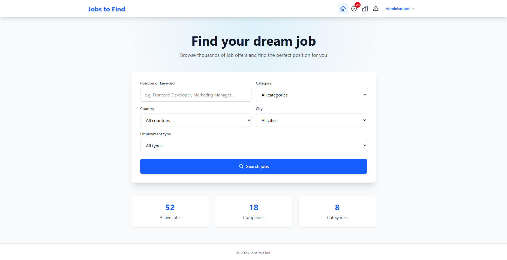
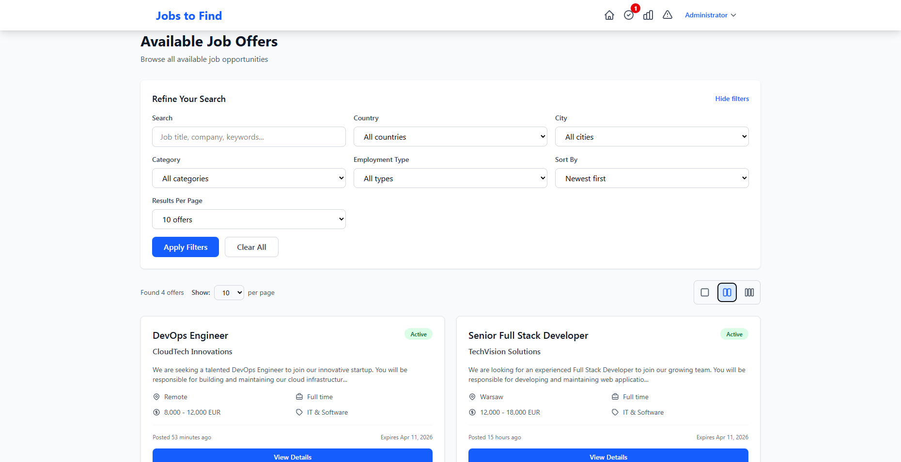
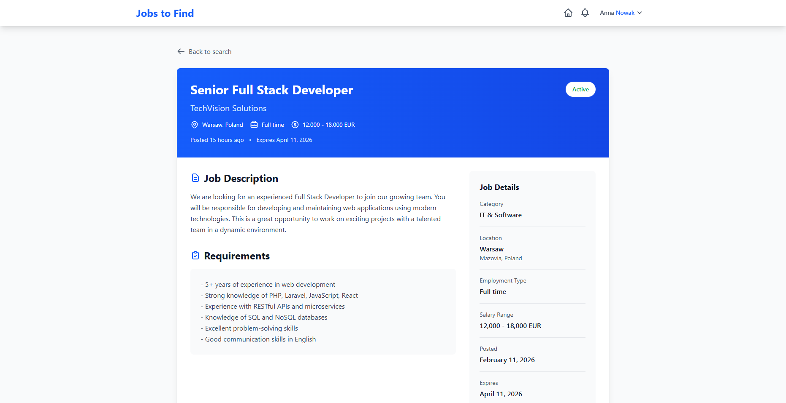
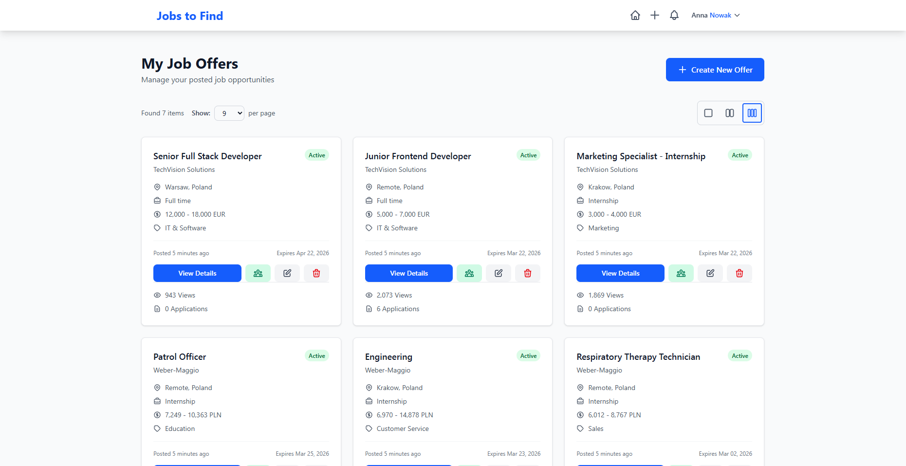
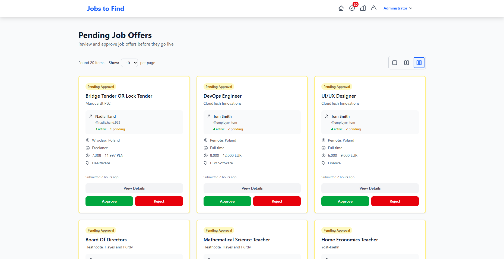

# Jobs to Find

A web application for publishing and searching job offers, built with Laravel framework and a user interface designed with Tailwind CSS.

## Screenshots

### Homepage


### Search Results


### Job Offer Details


### My Offers (Employer Panel)


### Admin - Approve Offers


### Edit Profile


### Avatar Change


## Technologies

### Backend
- **Laravel** 12.0 - PHP framework
- **PHP** 8.2 - programming language
- **MySQL** - database management system
- **Eloquent ORM** - object-relational mapping

### Frontend
- **Tailwind CSS** 4.1.18 - CSS framework
- **Blade** - Laravel templating engine
- **JavaScript** - client-side interactivity
- **Cropper.js** 1.6.2 - JavaScript image cropper
- **Vite** 7.0.7 - bundler and development tool
- **Axios** 1.11.0 - HTTP client

### Development Tools
- **PHPUnit** - unit testing
- **Faker** - test data generation
- **Laravel Pint** - PHP code formatting
- **Laravel Sail** - Docker environment

## Database Structure

### Table: users
Stores system user data.
- `id` - primary key
- `first_name` - first name
- `last_name` - last name
- `username` - username (unique)
- `email` - email address (unique)
- `password` - password (hashed)
- `account_type` - role (job_seeker, employer, admin)
- `privacy_settings` - JSON column storing visibility preferences for profile sections
- `avatar` - path to user's avatar image
- `bio` - short biography
- `github_url` - link to GitHub profile
- `linkedin_url` - link to LinkedIn profile
- `cv_path` - path to uploaded CV
- `is_student` - boolean flag
- `date_of_birth` - user's birth date
- `country` - user's country
- `email_verified_at` - timestamp
- `timestamps` - created_at, updated_at

### Table: categories
Job offer categories (e.g., IT, Marketing, Sales).
- `id` - primary key
- `name` - category name (unique)
- `timestamps` - created_at, updated_at

### Table: locations
Job offer locations.
- `id` - primary key
- `country` - country
- `city` - city
- `timestamps` - created_at, updated_at

### Table: job_offers
Main table for job offers.
- `id` - primary key
- `user_id` - foreign key to users (employer)
- `title` - offer title (indexed)
- `description` - detailed description
- `requirements` - requirements (optional)
- `company_name` - company name
- `salary_range` - salary range (optional)
- `employment_type` - employment type (full-time, part-time, contract, internship)
- `category_id` - foreign key to categories (indexed)
- `location_id` - foreign key to locations (indexed)
- `is_active` - whether the offer is active (indexed)
- `is_approved` - whether the offer has been approved by administrator
- `expires_at` - expiration date (optional)
- `timestamps` - created_at (also used as approval date), updated_at

### Relations
- `job_offers.user_id` -> `users.id` (ON DELETE CASCADE)
- `job_offers.category_id` -> `categories.id` (ON DELETE CASCADE)
- `job_offers.location_id` -> `locations.id` (ON DELETE CASCADE)

## Implemented Features

### Users (roles)
- **job_seeker** - person looking for a job
- **employer** - employer publishing offers
- **admin** - system administrator

### Authorization System
- User registration with role selection
- Login and logout
- Middleware for route protection
- User profile with data editing capability

### Job Offers (CRUD)
- Browse job offers (public)
- Create offers by employers
- Edit own offers
- Delete offers
- Display offer details

### Search and Filtering
- Search by keywords in title and description
- Filter by category
- Filter by country and city
- Filter by employment type
- Sort results (newest, oldest, alphabetically)
- Filter form on results page
- Display active filters

### Pagination
- Display 10/20/30 offers per page (user choice)
- Preserve search parameters when changing pages
- Default 10 offers per page

### Admin Panel
- Browse pending offers (is_approved = false)
- Approve offers (sets is_approved = true and created_at to current date)
- Reject offers (sets is_active = false)
- Display employer statistics (first name, last name, username, number of active offers, number of pending offers)
- Admin actions also available in offer details view
- Custom confirmation dialogs for rejection actions

### Employer Panel
- List of own published offers
- Offer status (Pending Approval / Active)
- View count information (prepared, but not tracked in database)

### User Interface
- Responsive design (Tailwind CSS)
- Color-coded statuses
- Interactive elements with pointer cursor
- Modal dialogs with confirmations
- Clear navigation

### Code Organization
- Views divided into subfolders:
  - `employer/` - views for employers
  - `job-seeker/` - views for job seekers
  - `auth/` - authorization views
  - `public/` - public views
  - `admin/` - administrator views

## TODO

### Job Application System
- No ability for job_seekers to apply to offers
- No applications table to store applications
- No view with applications for employers
- No "My Applications" view for job_seekers

### Notification System
- No email notifications
- No in-app notifications
- No notifications about new offers matching profile
- No notifications about application status changes

### Employer Profile
- No dedicated companies table
- No extended company information
- No company logo
- No company page with all offers

### Job Seeker Profile
- No CV/resume upload
- No skills list
- No employment history
- No job alerts

### Messaging System
- No internal messaging system
- No employer-candidate communication

### User Verification
- No email address verification
- No password reset
- No company/employer verification

### Additional Features
- No saving favorite offers
- No tracking of offer view counts in database
- No statistics for employers (number of applications, conversion rate)
- No rating and review system for employers
- No export offers to PDF
- No LinkedIn integration
- No REST API for external integrations

### SEO and Marketing
- No meta tags for offers
- No sitemap.xml
- No advanced robots.txt
- No Schema.org structure for job offers

## Installation

### Requirements
- PHP >= 8.2
- Composer
- Node.js and npm
- MySQL

### Installation Steps

1. Clone the repository:
```bash
git clone https://github.com/your-username/jobstofind.git
cd jobstofind
```

2. Install PHP dependencies:
```bash
composer install
```

3. Install JavaScript dependencies:
```bash
npm install
```

4. Copy the configuration file:
```bash
cp .env.example .env
```

5. Generate application key:
```bash
php artisan key:generate
```

6. Configure database in `.env` file:
```
DB_CONNECTION=mysql
DB_HOST=127.0.0.1
DB_PORT=3306
DB_DATABASE=jobstofind
DB_USERNAME=root
DB_PASSWORD=
```

7. Run migrations and seeders:
```bash
php artisan migrate --seed
```

8. Build frontend assets:
```bash
npm run build
```

9. Start development server:
```bash
php artisan serve
```

10. (Optional) In a separate terminal, run Vite for hot reload:
```bash
npm run dev
```

The application will be available at: http://localhost:8000 or http://127.0.0.1:8000

### Test Data
After running seeders, test accounts are available:
- Administrator: check UserSeeder
- Employer: check UserSeeder
- Job Seeker: check UserSeeder

## License

This project is an educational/demonstration application.
